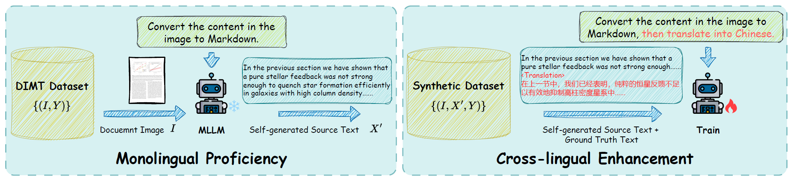

# Improving MLLM's Document Image Machine Translation via Synchronously Self-reviewing Its OCR Proficiency

This is the official repository for **SSR** fine-tuning paradigm introduced by the following paper: [***Improving MLLM's Document Image Machine Translation via Synchronously Self-reviewing Its OCR Proficiency (ACL 2025 Findings)***](https://aclanthology.org/2025.findings-acl.1213/)

## 📜 Abstract
Multimodal Large Language Models (MLLMs) have shown strong performance in document image tasks, especially Optical Character Recognition (OCR).
However, they struggle with Document Image Machine Translation (DIMT), which requires handling both crossmodal and cross-lingual challenges.
Previous efforts to enhance DIMT capability through Supervised Fine-Tuning (SFT) on the DIMT dataset often result in the forgetting of the model’s existing monolingual abilities, such as OCR.
To address these challenges, we introduce a novel fine-tuning paradigm, named **S**ynchronously **S**elf-**R**eviewing (**SSR**) its OCR proficiency, inspired by the concept "*Bilingual Cognitive Advantage*".
Specifically, SSR prompts the model to generate OCR text before producing translation text, which allows the model to leverage its strong monolingual OCR ability while learning to translate text across languages.
Comprehensive experiments demonstrate the proposed SSR learning helps mitigate catastrophic forgetting, improving the generalization ability of MLLMs on both OCR and DIMT tasks.

**The diagram of the proposed SSR.**


## 🛠️ SSR
As this method is simple and effective, we only provide the core idea, the prompt, and the evaluation code, but not the implementation details.
You are encouraged to realize the method using your preferred approach.

### 1. Download MLLM and the dataset
Download Qwen2-VL model from [Qwen/Qwen2-VL-7B-Instruct](https://huggingface.co/Qwen/Qwen2-VL-7B-Instruct)

The DoTA dataset can be downloaded from this [huggingface link](https://huggingface.co/datasets/liangyupu/DoTA_dataset).
Please send an email to [liangyupu2021@ia.ac.cn](mailto:liangyupu2021@ia.ac.cn) to inform your name and affiliated institution after submitting the download application on Hugging Face.

### 2. Monolingual proficiency
For Qwen2-VL, we recommend using [vLLM](https://github.com/vllm-project/vllm) for inference with the following OCR instruction to get **self-generated source text**.
```
Convert the content in the image to Markdown.
```

### 3. Cross-lingual enhancement
For Qwen2-VL, we recommend using [LLaMA-Factory](https://github.com/hiyouga/LLaMA-Factory) for SFT with the following synthetic data.
**Instruction**:
```
Convert the content in the image to Markdown, then translate into Chinese.
```
**Response**:
```
self-generated source text + <Translation> + ground truth target text
```

### 4. Inference and evaluation
For Qwen2-VL, we recommend using [vLLM](https://github.com/vllm-project/vllm) for inference with the following instruction, and employing regular experssions to get the final translation results.
```
Convert the content in the image to Markdown, then translate into Chinese.
```
For evaluation, run the following script.
```bash
bash evaluate.sh
```

## 🙏🏻 Acknowledgement
We thank [QwenLM](https://github.com/QwenLM/Qwen2.5-VL) project for providing the pre-trained model.

## ✍🏻 Citation
If you want to cite our paper, please use the following BibTex entries:
```BibTex
@inproceedings{liang-etal-2025-improving,
    title = "Improving {MLLM}{'}s Document Image Machine Translation via Synchronously Self-reviewing Its {OCR} Proficiency",
    author = "Liang, Yupu  and
      Zhang, Yaping  and
      Zhang, Zhiyang  and
      Chen, Zhiyuan  and
      Zhao, Yang  and
      Xiang, Lu  and
      Zong, Chengqing  and
      Zhou, Yu",
    editor = "Che, Wanxiang  and
      Nabende, Joyce  and
      Shutova, Ekaterina  and
      Pilehvar, Mohammad Taher",
    booktitle = "Findings of the Association for Computational Linguistics: ACL 2025",
    month = jul,
    year = "2025",
    address = "Vienna, Austria",
    publisher = "Association for Computational Linguistics",
    url = "https://aclanthology.org/2025.findings-acl.1213/",
    pages = "23659--23678",
    ISBN = "979-8-89176-256-5",
}
```
If you have any question, feel free to contact [liangyupu2021@ia.ac.cn](mailto:liangyupu2021@ia.ac.cn).
